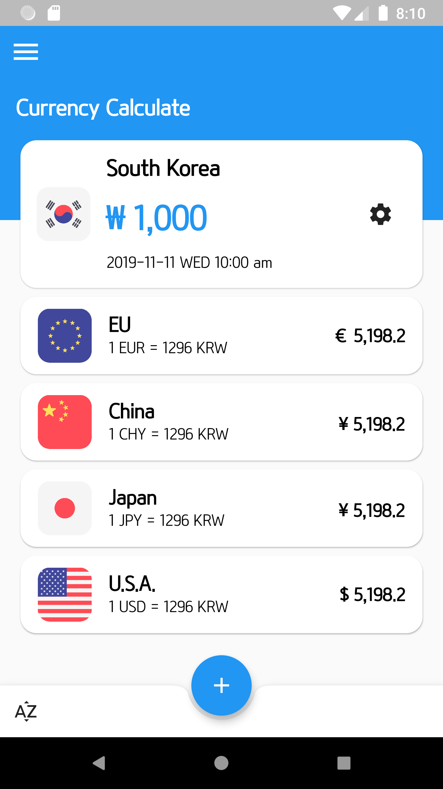
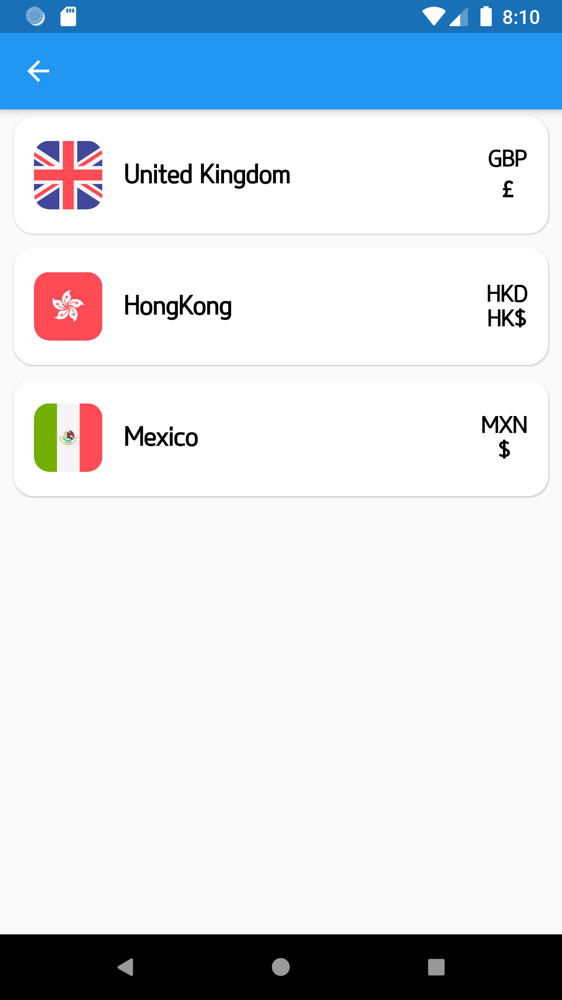
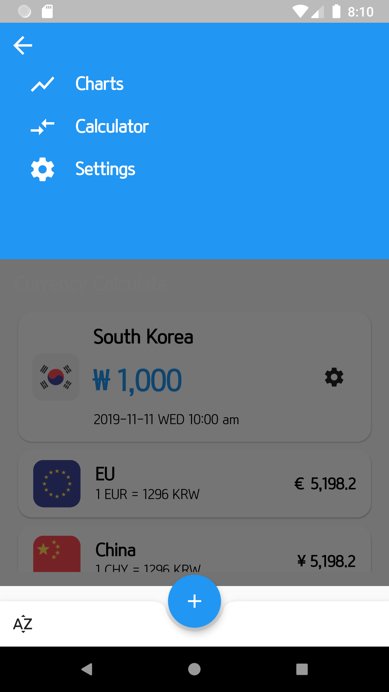

# flutter_currency

This app allows users to view real-time exchange rate information.

## 1. UI/UX inspiration
(https://dribbble.com/shots/6565328-Financial-Assistant-App-Animation?utm_source=pinterest&utm_medium=referral&utm_campaign=pinterest_dribbble_sharing)

## 2. Screenshot

     

## 3. Icon

https://www.flaticon.com/packs/international-flags-3

## 4. TODO 

- [x] 기본 레이아웃 만들기

- [ ] Main Page 만들기
  - [x] 환율 정보 List 추가
  - [x] 환율 정보 List 삭제
  - [ ] List item drag and drop 구현하기

- [ ] Chart Page 만들기

- [ ] Setting Page 만들기

- [ ] API 연결

